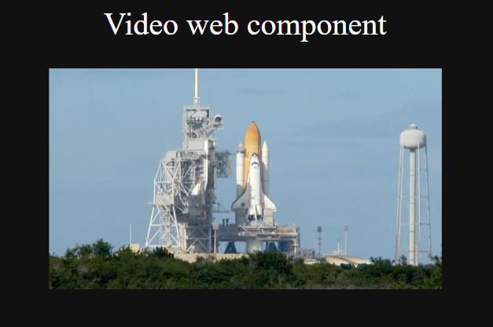
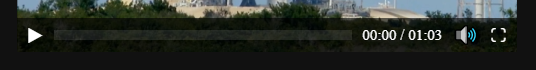
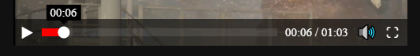
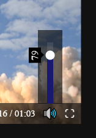
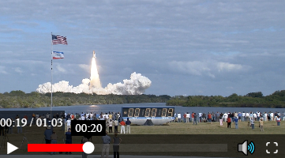

# Video-player-web-component


Web components are a set of technologies that create reusable custom elements and include some functionality such as element encapsulation.

This video component, which was created with vanilla js, can be produced using html or javascript, you can control the video using the keyboard because it was based on this [video player](https://github.com/VictorFranco/Custom-video-player), and also, if there is an error, it shows specific information about it.

## HTML
```HTML
    <video-player data-src="videos/Countdown To Rocket Launching.mp4"></video-player>
```
## Javascript
```javascript
    let video_tag=document.createElement("video-player");
    video_tag.setAttribute("data-src","videos/Countdown To Rocket Launching.mp4");
    document.querySelectorAll("video-player")[1].after(video_tag);
```

## Notes
### Which technologies does the component use?
* [web component](https://developer.mozilla.org/en-US/docs/Web/Web_Components "A suite of different technologies")
* [video API](https://developer.mozilla.org/en-US/docs/Learn/JavaScript/Client-side_web_APIs/Video_and_audio_APIs "Video and audio API")
### What happens if video component doesn't find the file?
The console will display the error, but you can set the attribute with js or html and it will works.
### What happens if I don't set the data-src attribute?
It will behave as if there is an error, but if you want to insert the html before, you could change this

Only in this case

---
```javascript
    /*You need to replace the video_error() method for this*/
    video_error(video_container,video_tag){
        /*If you think it isn't necessary you could delete the message*/
        if(this.getAttribute("data-src")!=""){
        console.log(`%cVideo error`,"font-size:20px",`
networkState: ${video_tag.networkState}
src: ${this.getAttribute("data-src")}`);
        console.log(this);}
        this.reset_tag(video_container);//Never delete
    }
```
---

## Screenshots


The video player has basic controls with some style



It also has a current time indicator and a tooltip 



The volume control looks like this



When the width is lower than 400px looks like this



## LICENSE
[GPLv3.0](LICENSE)
